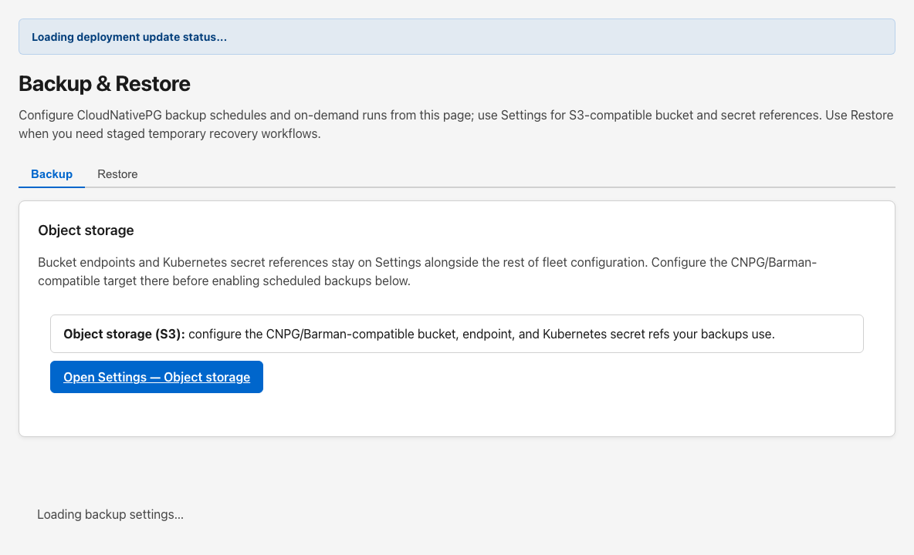

# Backup & Restore

## Start Here

1. Open **Settings → Object storage** first and configure the CNPG/Barman-compatible bucket, endpoint, and Kubernetes secret references.
2. On the **Backup** tab, enable scheduled backups and save automation settings.
3. Run **Check bucket (preflight)** before relying on a schedule or on-demand run.
4. Switch to the **Restore** tab only during a planned recovery drill or incident window.

## Why this matters

Backup and restore split operator concerns cleanly: reusable object-storage targets live on **Settings**, while CNPG schedules, on-demand runs, and staged restore workflows live here.

## Details

`Backup & Restore` is the active Gen 3 Control Panel route for CloudNativePG backup automation and staged database recovery. The page has two tabs:

| Tab | Route | Purpose |
| --- | --- | --- |
| Backup | `/dashboard/backup-restore` | CNPG schedule reconciliation and on-demand backup runs |
| Restore | `/dashboard/backup-restore?tab=restore` | Temporary recovery clusters and destructive live cutover |

The page description states that bucket endpoints and Kubernetes secret references stay on **Settings**, while this workspace handles CNPG schedules and staged restore workflows.

## Backup tab

### Object storage handoff

The **Object storage** card explains that S3-compatible bucket configuration belongs on **Settings**. Use **Open Settings — Object storage** to configure the CNPG/Barman-compatible target before enabling scheduled backups below.

Object storage fields on Settings include provider, endpoint, bucket, region, path prefix, secret references, and the **Backups** toggle that marks the target for CNPG use.

### Database backup automation (CloudNativePG)

When enabled, the Control Panel reconciles CNPG `Cluster` backup settings and `ScheduledBackup` objects in the deployment namespace.

Status badges at the top of the card show:

- **Reconcile** state (ok, error, or not run yet)
- **Bucket preflight** state (ok, failed, or not run)
- last reconcile timestamp and error text when present
- external bucket preflight step details when a preflight has run

#### Schedule and retention

Operators can:

- enable or disable scheduled backups
- pick schedule presets (hourly, every N hours, daily, weekly, or custom six-field cron)
- set UTC hour, minute, and weekday for daily/weekly presets
- edit raw cron directly in advanced mode
- choose retention quick presets or type a custom Barman-style retention value
- optionally set endpoint CA secret name and key

#### Cluster scope toggles

- **Admin DB cluster (cnpg-admin)**
- **Tenant DB cluster (cnpg-tenant)**
- **Immediate first backup**
- **Suspend schedule**

#### Actions

| Action | Purpose |
| --- | --- |
| Save backup automation | Persists schedule, retention, and scope settings |
| Run backup now | Triggers an on-demand backup when scheduled backups are enabled |
| Check bucket (preflight) | Verifies object-storage credentials and bucket reachability without changing databases |

## Restore tab

The restore workspace implements a **two-stage** CloudNativePG workflow:

1. **Create recovery cluster(s)** — provision temporary CNPG recovery workloads for validation only.
2. **Apply restore to environment** — destructive cutover after readiness reports `ready_for_promotion_checks`.

Temporary recovery provisioning never repoints live ingress by itself.

### Operator safety reminders shown in the UI

- Use a disposable namespace or maintenance window; recovery clusters consume storage like any CNPG cluster.
- Coordinate credentials and bucket prefixes with **Settings → Object storage**; GT AI OS references operator-managed secrets only.
- Stage-one APIs create recovery clusters ahead of promotion; they do not cut traffic alone.

### Stage 1 — Restore scope

Choose one of:

- **Single plane (admin or tenant CNPG timeline)** — restore one of `cnpg-admin` or `cnpg-tenant`
- **Full cluster (paired admin + tenant backups)** — coordinated admin and tenant restore using a shared recovery cluster base name

### Stage 2 — Choose backup snapshot(s)

The catalog lists backups newest-first using `endedAt` then `startedAt`. Rows show backup name, timestamp, AI OS version, backup set id, storage presence, and whether named restore is ready through the API.

- Single-plane mode reloads the catalog when you change the catalog plane selector.
- Full restore loads admin and tenant catalogs concurrently and warns when selected rows do not share a backup set id.

Use **Refresh** when new snapshots have landed in object storage.

### Stage 3 — Name recovery cluster(s)

- Single-plane mode requires a temporary recovery cluster name distinct from `cnpg-admin` / `cnpg-tenant`.
- Full restore derives `{base}-admin` and `{base}-tenant` from a shared temporary cluster base name.

Catalog selections populate backup identifiers automatically. Expand **Advanced** to type Backup CR names manually or use RFC 3339 point-in-time targets.

### Version awareness

The page compares running deployment version metadata with backup tags. Named restores can fail fast on version drift. Review the version hints before submitting.

### Fallback — upload restore intent JSON

A collapsed fallback accepts UTF-8 JSON restore intent for automation or air-gap handoffs. Upload bypasses interactive catalog safeguards and is not the default browse-and-restore path.

### Stage 4 — Create recovery cluster(s)

Before submitting, check the acknowledgment:

**I understand this only creates temporary CloudNativePG recovery cluster(s) for validation and does not yet replace the live environment.**

The primary button calls the recovery-cluster API (or the multipart JSON upload route when fallback upload is open).

### Readiness and live cutover

After a successful stage-one request, use **Check readiness now** or enable **Auto-refresh every 15s** to poll recovery-cluster status.

When readiness shows `ready_for_promotion_checks`, the destructive section appears. You must acknowledge:

**I understand Apply restore replaces the live environment and may interrupt Control Panel and tenant access until the restored databases are healthy again.**

**Apply restore to environment** deletes the live `cnpg-admin` / `cnpg-tenant` cluster resource(s) and recreates them from the validated recovery spec.

## Recommended workflow

### Routine backup posture

1. Configure object storage on [Settings](gen3-admin/settings).
2. Enable scheduled backups for the clusters you operate.
3. Save automation settings and confirm reconcile status is ok.
4. Run bucket preflight before the first scheduled or on-demand backup.

### Recovery drill

1. Open the **Restore** tab during a maintenance window.
2. Pick catalog snapshots and name temporary recovery clusters.
3. Create recovery cluster(s) and wait for readiness.
4. Apply restore only after deliberate acknowledgment of downtime risk.

## Best practices

- Keep object storage and backup automation as separate steps: configure the bucket on Settings, then reconcile schedules here.
- Run preflight before trusting a new bucket or secret rotation.
- Treat restore stage one as validation and stage two as a deliberate destructive action.
- Coordinate full restores on matching backup set ids whenever both catalogs expose them.

## Related pages

- [Settings](gen3-admin/settings)
- [Updates](gen3-admin/updates)
- [Dashboard](gen3-admin/dashboard)
