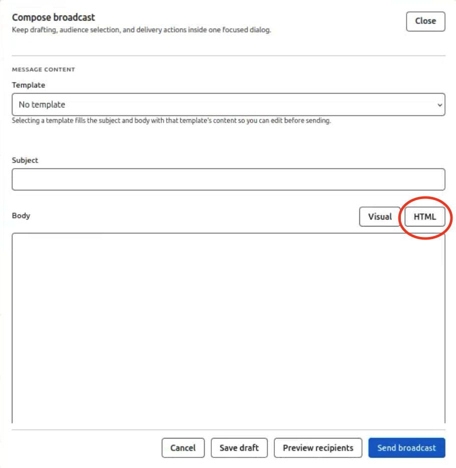

# Email Settings

## Start Here

1. Open **Email Settings**.
2. Configure SMTP or provider credentials for transactional email.
3. Publish tenant support email and portal links tenants see read-only in Account Settings.
4. Send a test message after credential changes.
5. For **broadcasts** on **v3.0.6-stable**, open **Compose broadcast**, switch the body editor to **HTML** before entering content, then send — see [Broadcasts](#broadcasts) below.

## Why this matters

Tenants display support contacts from this policy; wrong values generate support noise in the tenant app.

## Details

`Email Settings` is the active Gen 3 Control Panel route for outbound email and tenant-visible support policy. It combines SMTP transport, support-contact publishing, welcome-email controls, and broadcast compose/send/review.

**Email Templates & Modules** is a separate sidebar route documented at [Email Templates & Modules](gen3-admin/email-templates). Use that page when you need to create, edit, preview, or delete template bodies and shared modules—not when you are only configuring SMTP or sending a broadcast from Email Settings.

## What the page currently supports

- configuring SMTP host, port, credentials, and TLS posture
- publishing tenant-visible support email and support portal values
- enabling or disabling welcome email behavior
- editing welcome-email copy fields
- selecting welcome and password-reset templates for live email flows
- composing, previewing, sending, and reviewing broadcast records

## Main sections

### SMTP Configuration

This is the transport layer. If password resets or welcome emails are not being delivered, start here first.

### Support contact policy

This section controls what tenant users see under **Contact support**. It can publish email-only, portal-only, or combined support paths.

### Welcome email policy

Use this section to control whether onboarding email is sent and what subject/body content should be used.

### Broadcasts

Use the **Broadcasts** tab to compose audience-targeted messages, attach an existing broadcast template, include optional modules, preview recipients, and send or review broadcast records.

Template and module **authoring** lives on the separate **Email Templates & Modules** sidebar route. Email Settings consumes those artifacts when you pick templates for welcome, password-reset, or broadcast flows.

#### How to send a broadcast email

1. Open **Email Settings** and select the **Broadcasts** tab.
2. Click **Compose broadcast** (or open an existing draft).
3. Optionally choose a **Template** — selecting one fills the subject and body so you can edit before sending.
4. Enter the **Subject**.
5. In the **Body** editor, select **HTML** in the top-right toggle **before** you enter or paste broadcast content (see screenshot below). Do not compose in **Visual** mode first and switch afterward — that path can corrupt formatting on send in **v3.0.6-stable**.
6. Enter or paste your broadcast HTML in the body field.
7. Choose the audience (roles, explicit emails, or other filters supported on the form).
8. Click **Preview recipients** to confirm the audience, then **Send broadcast** (or **Save draft** to finish later).

#### Known issue — broadcast formatting (v3.0.6-stable)

On **v3.0.6-stable**, broadcast emails composed in **Visual** mode may not render with the intended formatting when sent (for example, line breaks, lists, or inline styling may appear wrong in the delivered message).

**Workaround:** Before entering any body content, switch the compose dialog to **HTML** mode and author the message as HTML. Sent broadcasts then render correctly for recipients.

This is a known bug in **v3.0.6-stable**; a fix is tracked for a future release. Until then, treat **HTML**-first composition as the required workflow for broadcasts.

## Recommended workflow

1. Confirm SMTP works.
2. Publish the correct support contact policy.
3. Review welcome-email behavior.
4. Confirm templates and broadcasts reflect the intended deployment communications.

## Troubleshooting sequence

If a user reports missing email:

1. Check SMTP configuration.
2. Confirm the welcome-email or password-reset path is actually enabled.
3. Confirm the support policy points to the right contact path.
4. Return to [Users](gen3-admin/users) if the underlying user action needs to be re-sent.

## Best practices

- Keep support email and support portal details accurate because they surface directly in the tenant shell.
- Treat SMTP transport and support-contact policy as separate concerns.
- Re-test or re-validate user onboarding after major welcome-email changes.
- On **v3.0.6-stable**, compose broadcasts in **HTML** mode before entering body content so sent messages render correctly.

## Related pages

- [Email Templates & Modules](gen3-admin/email-templates)
- [Users](gen3-admin/users)
- [Instructions Settings](gen3-admin/instructions-settings)
