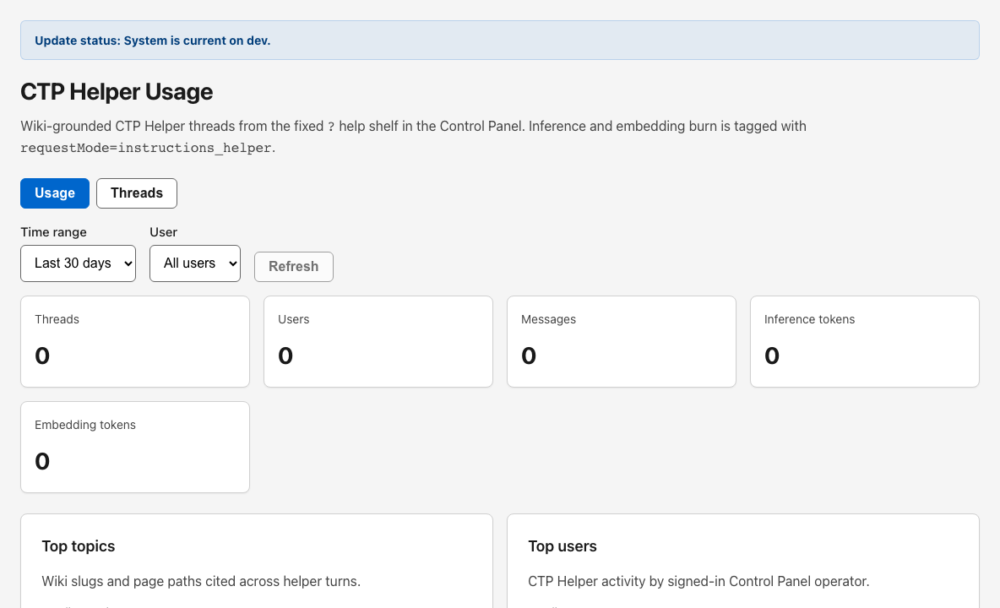

# CTP Helper Usage

## Start Here

1. Open **CTP Helper Usage** when you need operator-plane observability for the Control Panel **?** help shelf.
2. Start on the **Usage** subtab for aggregate burn and top topics.
3. Switch to **Threads** to inspect individual conversations, search text, and expand transcripts.
4. Filter by time range or user before exporting findings to an incident or billing review.

## Why this matters

CTP Helper Usage shows wiki-grounded help-shelf traffic from the Control Panel shell. It is separate from tenant-app GT Helper observability and from general tenant chat review.

## Details

`CTP Helper Usage` is the active Gen 3 Control Panel route at `/dashboard/helper-usage`. The page documents threads created through the fixed **?** help shelf in the Control Panel operator UI.

Inference and embedding burn on this page is tagged with `requestMode=instructions_helper`. The header also shows the active reporting window when data is loaded.

This page is **not** the tenant app **GT Helper** tab under Observability. It covers Control Panel operators only.

## Subtabs

| Subtab | Purpose |
| --- | --- |
| Usage | Aggregate counts, daily token burn, top topics, and top users |
| Threads | Searchable, paginated thread list with expandable transcripts |

Both subtabs share the toolbar filters below.

## Shared filters and actions

### Time range

- All time
- Today
- Last 7 days
- Last 30 days

### User

Filter to one signed-in Control Panel operator, or leave **All users** selected.

On the **Usage** subtab, **Top users** entries are clickable and jump to **Threads** filtered to that user.

### Search (Threads subtab only)

Use **Search threads** plus the **Search** button (Enter also applies the draft query).

**Refresh** reloads the current filter set on either subtab.

## Usage subtab

### Summary cards

The stat grid shows, for the current filters:

- Threads
- Users
- Messages
- Inference tokens
- Embedding tokens

When billing settlement fields are present, the page may also show:

- Settled billing chat tokens
- Settled billing total tokens

### Daily token burn

When time-series rows exist, a table lists inference vs embedding tokens per day.

### Top topics

Lists wiki slugs and page paths cited across helper turns, with mention counts. Rows may show a human label, page path, and slug code.

### Top users

Lists Control Panel operator activity with thread count, message count, and inference tokens. Selecting a user applies that user filter and switches to **Threads**.

## Threads subtab

The thread table shows:

- expand/collapse control
- thread title (new threads default to **GT Helper** until renamed from the first user message; the list may show **CTP Helper** when the stored title is empty)
- owner label
- message count
- updated and created timestamps

Expanding a row loads the full transcript. Each message shows role, timestamp, body text, and metadata when present:

- page path
- model name
- token counts (total, prompt, completion, embedding)
- cited wiki source slugs

Pagination loads twenty threads per page with **Previous** and **Next** controls.

## When to use CTP Helper Usage

Use this page when you need to answer questions like:

- Which operators are consuming help-shelf inference or embedding tokens?
- Which wiki topics drive the most helper traffic on the Control Panel?
- What did an operator ask during a specific help-shelf thread?
- Does instructions-helper traffic explain a spike in operator-plane model burn?

## Recommended investigation workflow

1. Set the time range to the incident or billing window.
2. Review aggregate cards and daily token burn on **Usage**.
3. Inspect **Top topics** for documentation gaps or repeated confusion.
4. Switch to **Threads**, filter by user if needed, and expand relevant transcripts.
5. Cross-check operator identity on [Users](gen3-admin/users) or sign-in evidence on [Access Logs](gen3-admin/access-logs) when required.

## Best practices

- Do not confuse this page with tenant GT Helper observability in the tenant app.
- Filter before deep transcript review so pagination stays scoped to the relevant operator set.
- Use top-topic slugs to improve [Instructions Settings](gen3-admin/instructions-settings) and wiki coverage instead of guessing from chat alone.
- Pair usage review with [Access Logs](gen3-admin/access-logs) when you need authentication context for the same operator window.

## Related pages

- [GT Helper](gen3-admin/instructions-helper)
- [Access Logs](gen3-admin/access-logs)
- [Instructions Settings](gen3-admin/instructions-settings)
- [Getting Started](gen3-admin/getting-started)
