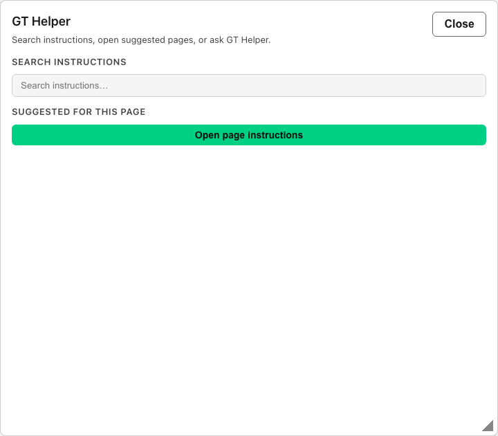

# GT Helper (Control Panel)

## Start Here

1. Look for the **?** bubble fixed on the Control Panel shell (lower-right on most operator pages).
2. Click **?** to open the **GT Helper** help shelf—the same hybrid layout as the tenant app: **Search instructions**, **Suggested for this page**, and **Ask GT Helper** chat.
3. Search the super-admin wiki or click **Open page instructions** for the article suggested for your current route.
4. Ask substantive Control Panel questions in **Ask GT Helper** when you want conversational operator guidance grounded in wiki excerpts.
5. Open the **Instructions** drawer from the sidebar footer (**Instructions**, book icon) or **Full instructions** in the help shelf for full articles and screenshots.

## Why this matters

Control Panel operators manage deployment-wide settings that tenant users never see. **GT Helper** on the Control Panel gives Super Admins and other signed-in operators the same conversational wiki assistance as the tenant app, but against the **super-admin instructions corpus** (models, SSO, licenses, backup, helper usage, and related runbooks).

Use the **?** shelf for interactive guidance on the page you are on; use the **Instructions** drawer when you need to browse or read full operator articles.

## Details

### Parity with the tenant help shelf

The Control Panel help shelf mirrors the tenant **GT Helper** experience:

| Feature | Tenant app | Control Panel |
| --- | --- | --- |
| **? bubble** | Yes | Yes |
| **Search instructions** | Role-filtered tenant corpus | Super-admin wiki corpus (no tenant role filter) |
| **Suggested for this page** | Route-mapped tenant slugs | Route-mapped Control Panel slugs |
| **Ask GT Helper chat** | Multi-turn threads | Multi-turn threads |
| **Instructions drawer** | Account menu / **Full instructions** | Sidebar **Instructions** (book icon) |
| **Product display name** | GT Helper | GT Helper |

GT Helper is **not** listed on tenant **Agents** and is unrelated to favorited chat agents.

### How answers are built

#### 1. Passive retrieval (every substantive question)

Before the model replies, the Control Panel API gathers excerpts from the **super-admin wiki index**:

1. **Corpus** — all super-admin navigation articles (no tenant role filter; operator session auth still applies).
2. **Keyword match** — title and body scored against your question.
3. **Route and topic injection** — articles tied to your current Control Panel path and detected question topics are injected even when keyword scores are weak.
4. **Hybrid rank** — keyword score plus route boost for page-relevant slugs.

Unlike the tenant app, passive ranking on the Control Panel does **not** incorporate **query embedding** in the rank—only keyword and route signals are used during passive retrieval.

Up to 20 excerpts may be included in the initial context.

#### 2. Agentic search (local tool loop)

When passive excerpts are missing or insufficient for a **GT AI OS product** question, the model may call **`search_instructions_wiki`** locally on the Control Panel API (same tool name as the tenant path).

- The tool loop runs **up to 5 rounds** on the Control Panel service.
- Each round executes a super-admin corpus search and returns excerpts to the model.
- If the loop limit is reached without a final answer, a **synthesis fallback** turn instructs the model to answer from excerpts and tool results already in the conversation—using general knowledge only for non-product portions—and **not** to invent product steps.

Casual messages skip passive retrieval and tool calls (see below).

### Grounding policy

The same product-vs-general split applies on the Control Panel as in the tenant app:

| Question type | Source | Behavior |
| --- | --- | --- |
| **GT AI OS product behavior** — Control Panel screens, routes, operator workflows, settings | Instructions wiki only | Answer from wiki excerpts and `search_instructions_wiki` results. Do not invent features or steps. |
| **General knowledge** — generic OIDC/SAML theory, markdown, industry concepts | General knowledge allowed | Clearly separated from GT AI OS-specific guidance. |
| **Mixed questions** | Both | General knowledge for non-product portions; wiki-backed guidance for GT AI OS portions. |
| **Missing wiki evidence** | None sufficient | State what is missing; suggest the **Instructions** drawer or a narrower search. |

Use **`[route: /dashboard/...|Label]`** in numbered steps and **`[slug: gen3-admin/...]`** at the end for the primary source article.

### Casual messages and multi-turn threads

- **Casual messages** (hi, thanks, etc.) get a brief reply without wiki search until you ask a substantive question.
- **Continuing threads** resolve pronouns from history, answer only the latest message, and avoid repeated greetings.

Prior helper threads appear in the help shelf thread rail with search and time filters.

### Configuration

**Ask GT Helper** requires a deployment default model:

1. Open **Models → Default Models**.
2. Set **Default GT Helper model** (`defaultInstructionsHelperModelId`) to an **enabled** chat-capable model.
3. Save. Both tenant and Control Panel help shelves use this default.

When unset or invalid, helper chat returns **503 Service Unavailable** with a configuration error.

See [Models](gen3-admin/models) for provider setup and default model administration.

### Observability

Control Panel GT Helper traffic is **not** shown on the tenant **GT Helper (Tenant)** tab.

Review operator help-shelf activity on **[CTP Helper Usage](gen3-admin/helper-usage)** (`/dashboard/helper-usage`):

- **Usage** — aggregate threads, messages, inference tokens, top cited wiki topics, and top operators.
- **Threads** — searchable transcripts with page paths and source slugs.

Inference burn is tagged with `requestMode=instructions_helper`.

### Instructions Settings

[Instructions Settings](gen3-admin/instructions-settings) controls the optional **external documentation link** shown alongside the built-in Instructions drawer. It does **not** author the repo-backed wiki corpus that GT Helper searches.

### Related pages

- [Models](gen3-admin/models)
- [CTP Helper Usage](gen3-admin/helper-usage)
- [Instructions Settings](gen3-admin/instructions-settings)
- [GT Helper](gen3/agents/helper-agent) — tenant app help shelf documentation
