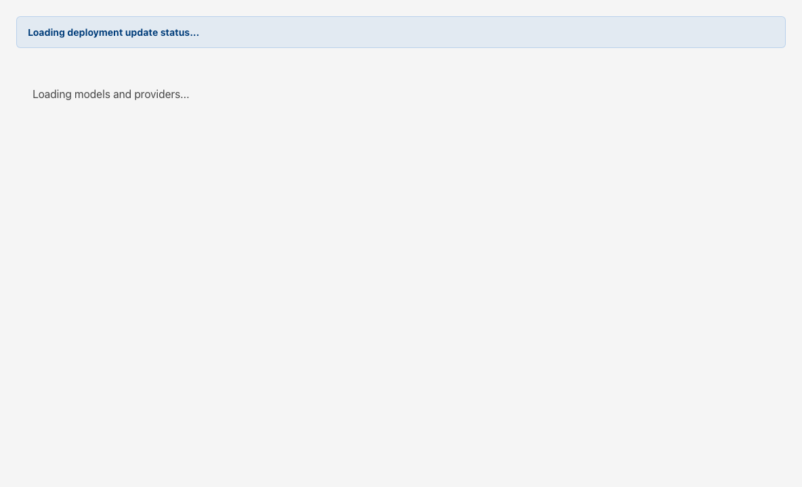
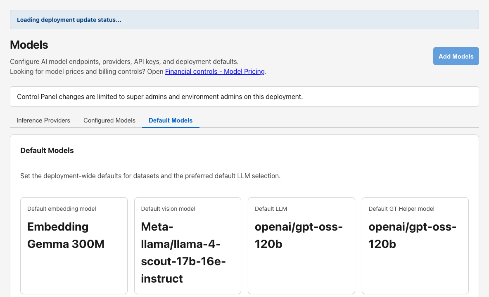

# Models

## Start Here

1. Open **Models** (canonical provider and registry workspace).
2. On **Inference Providers**, create or verify provider connectivity.
3. On **Configured Models**, import or enable models tenants may use.
4. On **Default Models**, set deployment-wide chat, embedding, vision, and GT Helper defaults.

## Why this matters

Models replaces legacy separate provider/API-key pages—tenant agents and GT API publishing depend on correct registry posture here.

## Details

`Models` is the active Gen 3 operator workspace for inference-provider integration, configured model registry management, and deployment default model selection. In the current Control Panel, this page absorbs the old provider and API-key workflows instead of splitting them across separate destinations.

## The three active tabs

| Tab | What it controls |
| --- | --- |
| `Inference Providers` | provider catalog, credentials, connectivity tests, discovery, and chat-auth validation |
| `Configured Models` | model registry entries, imports, manual adds, quick discovery adds, enablement, and deletion |
| `Default Models` | deployment-wide default chat, embedding, vision, GT Helper, STT, TTS, and image-generation model choices |

## Inference Providers

Use the providers tab to:

- create or edit a provider
- configure endpoint and adapter details
- supply or replace credentials
- test the connection
- validate chat authentication with a minimal request
- discover models from the provider catalog

Preloaded providers can also expose a reset-to-default-endpoint action when catalog defaults should be restored.

## Configured Models

Use the configured models tab to:

- review which models are actually registered for the deployment
- add models manually
- import models from a configuration bundle
- discover models from an upstream provider and import selected entries
- enable, disable, or delete registry entries

## Default Models

Use the defaults tab to choose the deployment-wide default model selections consumed across GT AI OS. These defaults matter whenever a tenant workflow depends on the system's baseline model posture rather than a custom per-agent override.

Super Admins can set:

- **Default embedding model** and **Default vision model** — paired dataset defaults when creating datasets without explicit model choices.
- **Default LLM** — deployment-wide text model when a flow does not specify one.
- **Default GT Helper model** (`defaultInstructionsHelperModelId`) — chat-capable model used by the integrated **?** help shelf when users ask [GT Helper](gen3-admin/instructions-helper) in the tenant app or Control Panel. If this field is unset or invalid, **Ask helper** returns `503` with a configuration error until an enabled chat-text model is selected.
- **Default STT**, **Default TTS**, and **Default image generation model** — speech and image flows that omit explicit model selections.
- **Default web search** — **off by default**. When enabled, selects a web search model agents may inherit; each agent still requires **Allow this agent to use web search** and an enabled/inherit web search mode before **`web_search`** runs in chat.

Only Super Admins can change default model selections; other operator roles can review the current posture on this tab.

## Relationship to legacy routes

The Control Panel still contains redirect shims for `providers` and `api-keys`, but the active operator workflow lives on `Models`. Treat this page as the canonical location for provider, model, and default-model administration.

## Recommended workflow for a new provider

1. Create the provider on `Inference Providers`.
2. Save credentials and endpoint details.
3. Test connectivity.
4. Validate chat authentication.
5. Discover or manually add models.
6. Set defaults if the provider will become the new deployment baseline.

## Best practices

- Validate provider connectivity before importing models.
- Keep provider changes and default-model changes as separate operator decisions when possible.
- Import only the models the deployment actually plans to use.
- Review [Financial Controls](gen3-admin/financial-controls) after major model-catalog changes so pricing stays aligned.

## Related pages

- [GT Helper](gen3-admin/instructions-helper)
- [Financial Controls](gen3-admin/financial-controls)
- [Settings](gen3-admin/settings)
