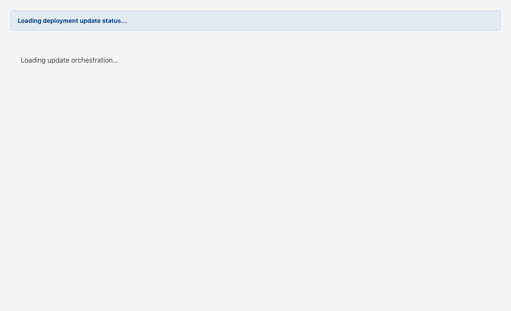

# Updates

## Start Here

1. Open **Updates** after confirming [Backup & Restore](gen3-admin/backup-restore) posture when the deployment requires pre-update backups.
2. Review **Deployment state** for the current version, rollback target, and execution mode.
3. Choose a compatible **Target version**, create an update request, then approve it when status is **Pending approval**.
4. Monitor **Current request** and the **Progress log** until the run succeeds or fails.

## Why this matters

Updates orchestrate immutable GT AI OS release changes through a request-and-approve workflow so the Control Panel web pod never receives direct deploy privileges.

## Details

`Updates` is the active Gen 3 Control Panel route for deployment update orchestration. The page loads runtime state, eligible release targets, the latest update request, progress events, and optional storage preflight results. It refreshes automatically every five seconds.

Only **super admins** can create update requests, approve pending requests, or request rollbacks. Other signed-in operators can review state in read-only posture.

## Deployment state

The top card summarizes:

| Field | Meaning |
| --- | --- |
| Current version | Immutable release currently running in the deployment namespace |
| Previous version | Recorded rollback target used when a post-deploy gate fails |
| Release contract | Shared chart path and values model for CLI, Control Panel, and GitOps workflows |

Each card also notes the deployment namespace and execution mode reported by the runtime API.

## Available versions

Use the **Target version** dropdown to pick a compatible release newer than the current version. When no compatible targets exist, the selector shows **No compatible target versions**.

For the selected release, the page shows:

- chart version
- release channel
- release notes (or a note when none are published)
- maintenance warning text when the release publishes one

### Backup warning override

When the runtime reports an active backup preflight warning that can be bypassed, the page shows a **Backup warning** callout with summary, detail, and last-check timestamp. You must check **I understand this update will continue without requiring a pre-update backup** before **Update anyway** becomes valid.

Without an active bypassable warning, the primary action label is **Create update request**.

### Primary actions

| Action | When it applies |
| --- | --- |
| Create update request / Update anyway | Starts a new update request for the selected target version |
| Request rollback | Creates a rollback request to the recorded previous version |

Update and rollback requests use client-generated idempotency keys so repeated clicks do not create duplicate in-flight requests for the same action and target.

## Current request

When a request exists, this section shows:

- request status badge (for example Pending approval, Running, Waiting for GitOps, Succeeded, Failed, Rollback running)
- action direction from current version to target version
- current step and attempt count
- execution mode and last error when present

**Approve request** is enabled only while status is **Pending approval** and you are a super admin.

If the request was created with a backup warning override, a note explains that approval will continue without requiring a pre-update backup.

### Storage preflight

When the API attaches storage-capacity results, a nested card shows:

- capacity status (available or blocked)
- additional required storage and schedulable capacity
- CNPG PVC contract volumes
- blocking reason or probe error when preflight failed
- remediation bullet list when provided

### Progress log

The progress table lists timestamped step events with step name, status, and summary or detail text.

When no requests exist yet, the section states that no deployment update requests have been created.

## Recommended workflow

1. Confirm current and previous versions on **Deployment state**.
2. Pick the target release and read release notes or maintenance warnings.
3. Resolve any backup warning or acknowledge the override deliberately.
4. Create the update request.
5. Approve the request when it reaches **Pending approval**.
6. Watch the progress log through completion.
7. Use **Request rollback** only when you intend to return to the recorded previous version.

## Best practices

- Treat backup warnings as operator signals, not cosmetic copy.
- Do not approve a request until storage preflight and backup posture match your change window.
- Use rollback against the recorded previous version rather than inventing ad hoc targets in other tools.
- Coordinate with [Backup & Restore](gen3-admin/backup-restore) before major upgrades when pre-update backups are required.

## Related pages

- [Backup & Restore](gen3-admin/backup-restore)
- [Settings](gen3-admin/settings)
- [Dashboard](gen3-admin/dashboard)
