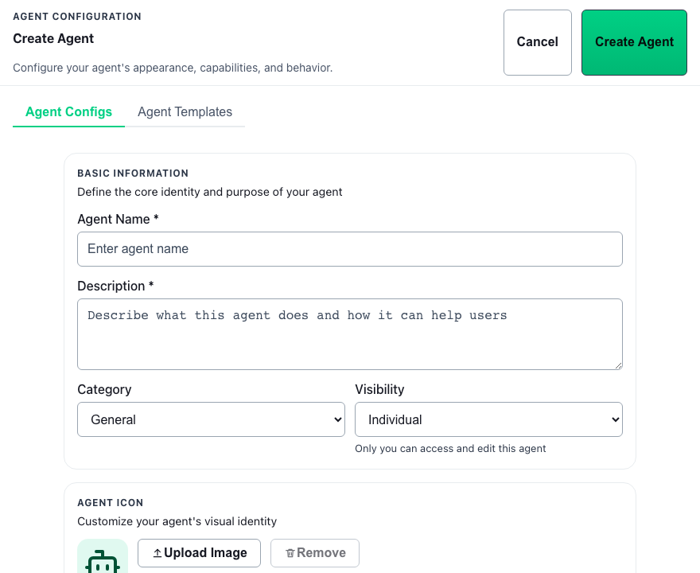
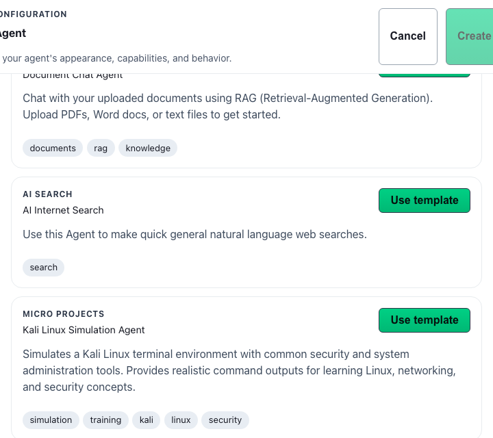
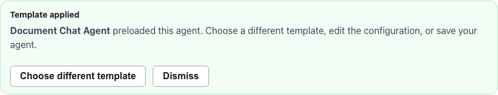
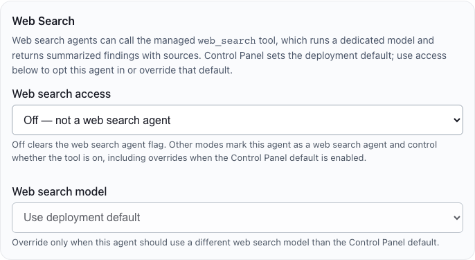

# Building Agents

## Start Here

1. Open **Agents** → sidebar **Configuration** (or **Agent Configuration** view).
2. Select **Create Agent** and choose **Agent Configs** for a blank form or **Agent Templates** to preload from the catalog.
3. Set instructions, model, datasets, modality tabs, and **Web Search Settings** as needed.
4. Save the agent and test immediately in **GT Chat**.

## Why this matters

Well-built agents encode repeatable behavior so operators do not re-type complex prompts and policy in every conversation. Gen 3 separates quick template preloads from deep capability tuning so you can start fast without guessing which tools and models apply.

## Details

Use the **Agent Configuration** workspace on [Agents](gen3/agents) when you need to create a new agent or revise an existing one. In the active Gen 3 product, agent creation is a practical workflow: pick a starting point (blank or template), define behavior, choose the right model posture, attach datasets, enable managed tools where appropriate, then validate the result in chat.

## Start from a template

When you select **Create Agent**, the configuration panel exposes two top-level tabs:

| Tab | Use when |
| --- | --- |
| **Agent Configs** | You want a blank form or you already applied a template and are editing the preloaded fields. |
| **Agent Templates** | You want to browse the live template catalog and preload an agent from a CSV starter. |

### Catalog source and refresh

Templates are **not** bundled inside the tenant app. The catalog is fetched live from `GT-Edge-AI-Internal/GT-AI-OS-Instructions/agent-templates/*.csv` through the tenant API (Control Panel proxies GitHub on behalf of the tenant). Opening **Agent Templates** triggers a fresh catalog fetch; use **Refresh templates** to retry after network or GitHub errors.

New `.csv` files added to `agent-templates/` in the instructions repository appear automatically on the next catalog load—no tenant redeploy required.

### Preload matrix (CSV → editor)

The tenant API reads the header row and first data row of each template CSV. Mapped columns populate the agent editor:

| CSV column(s) | Editor field |
| --- | --- |
| `name` | Agent name |
| `description` | Description |
| `category` | Category |
| `tags` | Tags (comma- or pipe-delimited) |
| `model` / `model_id` | Chat model (resolved against tenant chat models by id, model id, or display name) |
| `prompt_template` / `system_prompt` / `systemprompt` | System prompt |
| `disclaimer` | Disclaimer |
| `temperature` | Temperature |
| `easy_prompts` / `easy_buttons` | Easy buttons (pipe-delimited) |
| `visibility` | Visibility (`individual`/`private` → private; `team`/`group` → group; `organization`/`tenant` → tenant) |
| `selected_dataset_ids` / `dataset_ids` / `selected_dataset_names` / `dataset_names` | Attached datasets (UUID or dataset name match) |

**Ignored columns:** `max_tokens` and `dataset_connection` are present in legacy template CSVs for compatibility but are **not** applied to Gen 3 agent records.

**Not enabled by templates:** Applying a template does **not** turn on web search, vision, speech-to-text, text-to-speech, or image generation. Those capabilities stay at deployment and agent defaults until you configure the modality tabs manually after preload.

Selecting **Use template** switches you to **Agent Configs** with a **Template applied** banner so you can review, adjust, and save.

### Available templates (8)

| Template file | Purpose |
| --- | --- |
| `document-chat-agent.csv` | Document Q&A with RAG over uploaded files |
| `internet-search-agent.csv` | Web research with sourced answers (enable web search separately after apply) |
| `system-prompt-reviewer.csv` | Review and improve system prompts |
| `nemotron-agent.csv` | Local Nemotron on Ollama for advanced reasoning |
| `nemotron-mini-agent.csv` | Fast Nemotron Mini on Ollama |
| `python_coding_microproject.csv` | Python / Streamlit coding tutor |
| `vision-chat-agent.csv` | Vision-enabled RAG over image datasets (configure vision tab after apply) |
| `kali_linux_shell_simulator.csv` | Simulated Kali Linux terminal for training |

### Template failure modes

| Symptom | Likely cause |
| --- | --- |
| Catalog fails to load | Tenant cannot reach Control Panel / GitHub; check network and retry **Refresh templates**. |
| Empty catalog | No `.csv` files in `agent-templates/` or GitHub listing error. |
| Card shows summary error | Individual CSV could not be parsed (malformed quoting, missing data row). |
| Apply fails | CSV missing required header/data row or tenant API rejected the fetch. |
| Model field empty or wrong | Template model string does not match any tenant chat model; pick a model manually on **Chat Model Settings**. |
| Datasets not attached | Names or UUIDs in CSV do not match datasets in your tenant. |

Templates preload text and defaults only—they do not create datasets or publish models.

## Agent capabilities and tools

Inside **Agent Configs**, **Agent Settings** uses modality tabs:

- **Chat Model Settings** — chat model, temperature, system prompt
- **STT / TTS Settings** — speech input and output models
- **Vision Settings** — vision model for image understanding
- **Image Generation Settings** — image creation defaults
- **Web Search Settings** — managed public-web research tool

### Managed chat tools (tenant UI)

Gen 3 exposes a fixed set of **managed** tools the chat model may call during **GT Chat**. The agent configuration UI does **not** expose arbitrary MCP integration pickers—operators tune behavior through datasets, modality tabs, and web search gates below.

| Tool | When the model uses it | Operator notes |
| --- | --- | --- |
| `search_datasets` | Retrieve and count evidence from **conversation-attached datasets**, agent default datasets, or staged upload documents in the current chat scope. | Requires dataset or document scope in the thread. Not a substitute for public-web research. |
| `analyze_image` | Direct vision review of images already stored in scoped datasets. | Requires vision model configuration and image-bearing documents. |
| `generate_image` | Create a new image from a text prompt using agent or deployment image-generation defaults. | Requires image generation model configuration. |
| `web_search` | Live public-web research through the deployment or agent web search model. | Requires the **web search triple gate** (below). Separate from dataset retrieval. |
| `translate_text` | Translate text through tenant-configured translation models. | Uses deployment/agent translation model routing. |

**No MCP executable tools in the agent builder:** Unlike legacy flows that surfaced configurable MCP integration ids in the UI, Gen 3 tenant agent configuration does not let operators attach arbitrary MCP servers. Managed tools above are executed by the platform when policy and model capabilities allow.

### Web search triple gate

The managed `web_search` tool runs only when **all three** are true:

1. **Deployment default** — Control Panel **Models → Default Models** enables web search and selects a web search model (off by default; see [Models](gen3-admin/models)).
2. **Agent web search mode** — **Web Search Settings → Web search mode** is **Enabled**, or **Inherit deployment default** while deployment web search is on.
3. **Agent checkbox** — **Allow this agent to use web search** (`webSearchAgent`) is checked on the agent.

If any gate is false, chat will not invoke `web_search` for that agent even when the user asks for current events.

### Chat tool timeline

During streaming replies, **GT Chat** surfaces tool activity on the assistant message (for example “Search datasets”, “Web search”, “Generate image”). Completed, skipped, and failed tool steps appear in the activity strip so you can see whether retrieval ran, was deduplicated, or failed before the final answer.

## Core build sequence (blank form)

1. Give the agent a clear name that reflects the work it should do.
2. Write instructions that define the job, constraints, and expected style.
3. Choose the appropriate model or runtime configuration.
4. Attach only the datasets that should travel with the agent by default.
5. Configure modality and web search tabs when the job needs vision, speech, images, or public-web research.
6. Save the agent.
7. Test it in [GT Chat](gen3/chat).

## What makes a good Gen 3 agent

### Specific instructions

Agent instructions should describe a concrete operating posture, not a vague personality. Tell the agent what sources it should rely on, what kinds of outputs it should produce, and any workflow constraints that matter.

### Intentional dataset defaults

Attach default datasets only when they should be part of nearly every use of the agent. If the source material changes per conversation, leave the agent lean and attach datasets from chat instead.

### Model fit

Use the model that matches the task. The goal is reliable execution, not maximum size by default.

## Build-review loop

After every meaningful change:

1. launch the agent in [GT Chat](gen3/chat)
2. ask a prompt that represents the real use case
3. confirm the behavior, tool usage, and source grounding are correct
4. return to configuration only if the result shows a real gap

## Common mistakes

- attaching too many datasets to one agent
- writing instructions that are too broad to produce repeatable behavior
- expecting web research from `search_datasets` instead of enabling `web_search`
- changing multiple variables at once and then not knowing which change helped
- forgetting to re-test after model, dataset, or tool-setting changes

## Best practices

- Build separate agents for separate jobs.
- Keep default retrieval context small and purposeful.
- Use favorites only after the agent is stable enough for regular use.
- Export important agents before large refactors.
- After applying a template, walk every modality tab before publishing to other users.

## Related pages

- [Agents](gen3/agents)
- [Sharing Agents](gen3/agents/sharing)
- [Using Datasets in Chat](gen3/chat/using-datasets)
- [Control Panel Models](gen3-admin/models)
- [GT Helper](gen3/agents/helper-agent)
