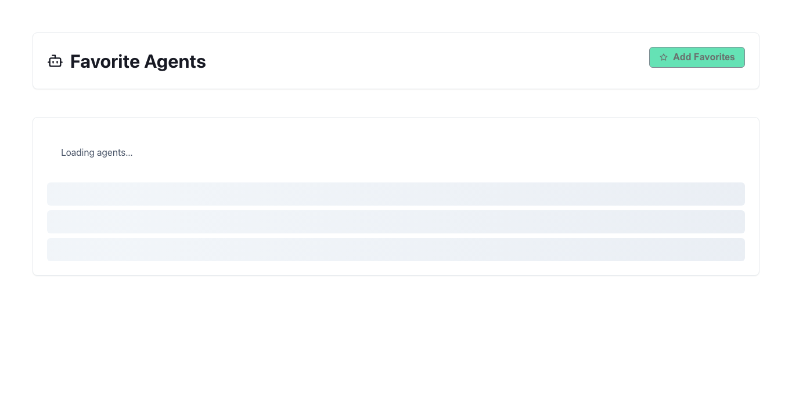

# Agents

## Start Here

1. Open **Agents** and stay on **Favorite Agents** for daily launches.
2. Select **Add Favorites**.
3. Add your desired agents or select all, then click **Save Selection**.
4. Switch to **Agent Configuration** when you need to edit instructions, models, or datasets.
5. Launch **GT Chat** from an agent card to validate behavior.

## Why this matters

Agents define how work runs; favorites reduce friction for repeated missions without browsing the full catalog each time.

## Details

Agents are still the main reusable work unit in Gen 3. The active tenant `Agents` page combines two workflows: a quick **Favorite Agents** view for day-to-day use and a full **Agent Configuration** view for creating, editing, importing, exporting, and organizing agents.

## What the page is for

Use `Agents` to:

- keep a short list of favorite agents for fast launch into chat
- browse the full agent catalog
- create a new agent
- edit existing instructions, model settings, and dataset attachments
- import or export agent definitions
- launch work in [GT Chat](gen3/chat)

## The two active views

### Favorite Agents

This is the operator-facing quick workspace. It shows only the agents you have pinned as favorites so you can move into chat quickly without browsing the full catalog every time.

### Agent Configuration

This is the deeper workspace. Use it when you need to build an agent, review its attached datasets, change sharing posture, or manage imports and exports.

## Common tasks

### Add favorite agents

1. Open `Agents`.
2. Stay in **Favorite Agents**.
3. Select **Add Favorites**.
4. Pick the agents you want in the quick workspace.
5. Save the selection.

### Create a new agent

1. Switch to **Agent Configuration** (**Agents** sidebar → **Configuration**).
2. Select **Create Agent**.
3. Choose **Agent Configs** to start from a blank form, or **Agent Templates** to preload from the live CSV catalog (`agent-templates/*.csv` via tenant API)—see [Building Agents](gen3/agents/building).
4. Complete the configuration form (review modality and web search tabs after a template apply).
5. Save the agent.
6. Launch it in [GT Chat](gen3/chat) to validate the behavior.

### Import or export an agent

**Import** and **Export** in the configuration workspace move **saved agent definitions** (JSON/CSV bundles you already exported or received)—they are **not** the same as the **Agent Templates** catalog tab. Use **Agent Templates** for curated starters from the instructions repo; use **Import** when you have a full agent export file to restore.

## How agents relate to datasets

Agents and datasets are linked but not interchangeable:

- the agent defines how work should be performed
- datasets define what source material retrieval can search

If a chat answer is missing the right source material, the fix is often in [Datasets](gen3/datasets) or the agent's dataset configuration rather than in the prompt alone.

## When to use Favorites vs Configuration

| Need | Best view |
| --- | --- |
| Start work quickly | Favorite Agents |
| Edit instructions or model choices | Agent Configuration |
| Attach or review default datasets | Agent Configuration |
| Start from instructions-repo CSV starter | Agent Configuration → **Create Agent** → **Agent Templates** |
| Import or export saved agent definitions | Agent Configuration → Import / Export |

## Best practices

- Keep favorites limited to the agents you use repeatedly.
- Build separate agents for meaningfully different workflows instead of overloading one general-purpose prompt.
- Validate agent changes in [GT Chat](gen3/chat) immediately after saving.
- Review [Sharing Agents](gen3/agents/sharing) before assuming other users can see or use the agent.

## Related topics

- [Building Agents](gen3/agents/building)
- [Sharing Agents](gen3/agents/sharing)
- [GT Helper](gen3/agents/helper-agent)
- [GT Chat](gen3/chat)
- [Datasets](gen3/datasets)
