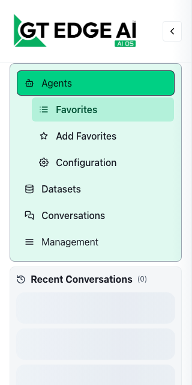
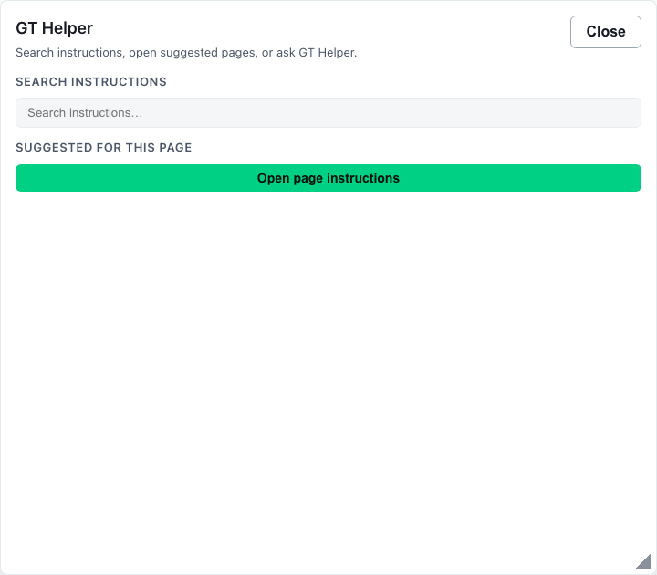

# Getting Started

## Start Here

1. Open the tenant app and confirm you can reach **Agents**, **Datasets**, and **Conversations** from the sidebar.
2. Read the core workspaces table below and open the page that matches your first task.
3. Pin favorite agents ([Agents](gen3/agents)) and create or verify datasets before long chat sessions.
4. Review [How to Build Your AI Workflow](gen3/workflows) for document review, diagrams, and mock assessments.
5. Configure external integrations in [GT API](gen3/gt-api/overview) when your account has GT API enabled and tools must call tenant models outside the UI.

## Why this matters

Getting Started orients you to the **active Gen 3 route surface** so you do not hunt deprecated Gen 2 pages. It links chat, agents, datasets, groups, API access, and role-gated administration in one map.

## Details

GT AI OS Gen 3 keeps the familiar GT2 pattern of working through agents and datasets, but the tenant shell now exposes that work through a smaller set of route-level workspaces. This instructions set documents only the pages that are actively surfaced in the current Gen 3 tenant experience.

## Sidebar layout

The tenant shell uses an expandable left sidebar. Expanded mode shows labels, inline submenus, and recent conversation history; collapsed mode shrinks to a **rail** of icons with flyout menus for **Agents** and **Management**.

### Expanded navigation order

Top to bottom in the main nav card:

1. **Agents** (submenu) — **Favorites**, **Add Favorites**, **Configuration**
2. **Datasets**
3. **Conversations**
4. **GT API** — primary top-level link when **GT API is enabled** for your account (`gtApiEnabled`); hidden when disabled
5. **Management** (dropdown) — **Observability**, **Users** (owners and managers only), **Groups**, **Model Catalog**

Below the nav card: **Recent Conversations** history. Footer: **account menu** (avatar) for **Settings** or **Profile**, **GT AI OS Instructions**, support links, and deployment/version labels.

### Collapsed rail

When collapsed, the rail shows icon buttons for **Agents** (flyout with the same three agent actions), **Datasets**, **Conversations**, **GT API** (when enabled), then **individual icons** for each visible Management route (**Observability**, **Users**, **Groups**, **Model Catalog**)—Management is flattened rather than nested in rail mode.

### Account menu vs sidebar

**GT AI OS Instructions** and **Account Settings** / **Profile** live in the **account menu** at the bottom of the sidebar—not as primary sidebar nav items.

## Core tenant workspaces

| Workspace | What you do there | Sidebar / access notes |
| --- | --- | --- |
| [GT Chat](gen3/chat) | Run live conversations, attach datasets, upload working files, and review assistant responses as they stream. | Open from an agent card or `/chat`; not a top-level sidebar item in Gen 3. |
| [Agents](gen3/agents) | Maintain favorites, open the configuration workspace, create agents, and launch chat from an agent. | Sidebar **Agents**. |
| [Datasets](gen3/datasets) | Create datasets, upload or import source material, review documents, and manage sharing. | Sidebar **Datasets**. |
| [Groups](gen3/groups) | Collaborate with other users, manage invitations, and share agents or datasets into a group. | Sidebar **Groups**. |
| [Model Catalog](gen3/model-catalog) | Browse read-only inference models, deployment defaults by capability, providers, and modality summaries. | **Management → Model Catalog** (alongside **Observability**, **Users**, and **Groups**). |
| [Conversations](gen3/conversations) | Search, review, reopen, and export stored conversation history. | Sidebar **Conversations**. |
| [Observability](gen3/observability) | Review usage, conversation, storage, access, GT API, billing, and **GT Helper (Tenant)** analytics within your role scope. | **Management → Observability** (all signed-in roles; tabs vary by role). |
| [Users](gen3/users) | Manage tenant accounts when you are a tenant owner or tenant manager. | **Management → Users** (owners and managers only). |
| [Account Settings](gen3/settings) | Review tenant policy, profile-facing details, and account-recovery settings. | User account menu at the bottom of the sidebar (**Settings** for tenant owners, **Profile** for other roles)—not a sidebar nav item. |
| [Support](gen3/getting-support) | Reach support contacts and use built-in help/reporting paths. | Support menu / footer links. |
| [GT API](gen3/gt-api/overview) | Publish inference names, manage API keys, and integrate OpenAI-compatible clients (`/gt-api`). | Primary sidebar link between **Conversations** and **Management** when **GT API is enabled** for your account (`gtApiEnabled`). |
| [How to Build Your AI Workflow](gen3/workflows) | Follow guided sequences for document review, diagram review, and mock assessments. | Instructions drawer / help shelf. |
| [GT Helper](gen3/agents/helper-agent) | Search wiki articles, open page suggestions, or ask the role-scoped helper. | **?** bubble on the tenant shell. |

Routes that are present only as redirects, aliases, or secondary workspaces are intentionally not part of the active Gen 3 instructions tree.

## Recommended first-day workflow

1. Open [Agents](gen3/agents) and choose the agents you expect to use most often.
2. Visit [Datasets](gen3/datasets) to confirm the documents and retrieval sources available to those agents.
3. Use [Groups](gen3/groups) if your work depends on shared resources or managed collaboration.
4. Launch chat from a favorite agent or open [GT Chat](gen3/chat) directly.
5. Use [Conversations](gen3/conversations) and [Observability](gen3/observability) to review what happened after the fact.

## How the routes work together

### GT Chat and Conversations

`GT Chat` is the live workspace. `Conversations` is the history workspace. Use chat when you are doing work right now, and use conversations when you need to search, reopen, or export prior work.

### Agents and Datasets

Agents define behavior. Datasets provide searchable source material. Many tenant workflows move back and forth between these two pages before returning to chat.

### Groups, Users, and Settings

Groups handle collaboration at the resource-sharing layer. Users handles tenant-account administration for authorized roles. Account Settings (opened from the user account menu, not the sidebar) holds tenant policy and recovery settings rather than collaboration controls.

## Role-aware navigation

- **Tenant User** sees the core workspace routes, **Management → Model Catalog**, **Management → Observability** (personal scope and a subset of tabs), and the **?** instructions helper. Does not see **Management → Users** or top-level **GT API** unless GT API is enabled for the account.
- **Tenant Manager** can open **Management → Users**, **Management → Model Catalog**, and **Management → Observability** with manager-appropriate tabs and scope.
- **Tenant Owner** has the full tenant administration posture, including tenant-wide user management, billing observability, and broader filters.

If you do not see a page referenced in these instructions, confirm your tenant role and whether **GT API enabled** applies to that route. Restricted wiki links in the Instructions drawer show a **role badge** on the link so you know why a destination may be unavailable.

## Migration note

Gen 2 and Gen 3 instructions remain live in parallel during migration. Gen 3 pages use the dedicated `gen3/...` namespace so the tenant drawer can move forward without removing the still-supported Gen 2 wiki tree.

## Next pages

- [GT Chat](gen3/chat)
- [Agents](gen3/agents)
- [Datasets](gen3/datasets)
- [Groups](gen3/groups)
- [Model Catalog](gen3/model-catalog)
- [GT API](gen3/gt-api/overview)
- [How to Build Your AI Workflow](gen3/workflows)
- [GT Helper](gen3/agents/helper-agent)
- [Support](gen3/getting-support)
