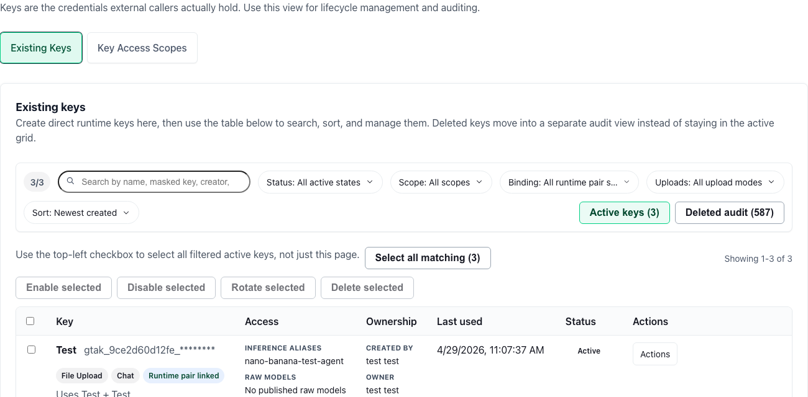

# GT API Keys and Access

## Start Here

1. Confirm **GT API is enabled** for your account. Without `gtApiEnabled`, the **GT API** sidebar route and key-management workspace are not available.
2. Open **GT API** at `/gt-api` and select the **API Keys** tab.
2. Choose **Create API Key** (wizard preset or manual form).
3. Pick a **purpose**: inference, upload, or conversation-facing.
4. Set **inference scopes** (`inference:chat`, `inference:embed`, `inference:transcribe`, `inference:speech`, `inference:image`) to match what the client will actually call.
5. Allowlist **agent aliases**, **raw-model catalog names**, and/or **dataset targets** the key may reach—then save and copy the secret immediately (shown once).

## Why this matters

API keys are the credential boundary for every external caller. Scoped keys keep discovery (`GET /v1/models`), chat, embeddings, uploads, and conversation flows **least-privilege** and **attributable**. Conversation-facing keys can inherit runtime allowlists (and prompt policy) from linked inference and upload keys so operators do not duplicate policy on every app integration.

**In-app workspace:** [GT API](/gt-api) → **API Keys**.

**Full documentation** (compatibility matrix, per-client runbooks, API reference) is in Instructions under **GT API**—see [Overview](gen3/gt-api/overview), [Compatibility Matrix](gen3/gt-api/compatibility-matrix), and [API Reference](gen3/gt-api/api-reference).

## Details

### Key purposes

| Purpose | Use when |
| --- | --- |
| **Inference** | Stateless or stateless-first OpenAI clients (`/v1/models`, `/v1/chat/completions`, optional embeddings/speech/image routes). |
| **Upload** | Automation that writes into fixed datasets (`POST /v1/datasets/{id}/files`). |
| **Conversation** | One external app credential that inherits linked inference + upload keys and supports GT conversation bootstrap and conversation-scoped files. |

### Guided presets (wizard)

The in-app wizard maps common clients to presets, including:

- **OpenAI-compatible chat client** — chat scope only; best for OpenAI SDK, curl, LiteLLM, Open WebUI, LibreChat.
- **Chat plus embeddings** — adds `inference:embed` for LangChain, LlamaIndex, Dify, Semantic Kernel, and similar.
- **Agentic IDE or editor** — dedicated chat key for Continue, Cursor, Cline/Roo, Aider, Manus, OpenClaw.
- **Voice and audio** — chat + transcribe + speech on one published multimodal alias.
- **Image generation** — `inference:image` for `/v1/images/generations`.
- **Dataset upload automation** — upload purpose for n8n, Langflow, Flowise ingestion-only flows.
- **Conversation app with uploads** — conversation purpose; requires reusable inference and upload keys first, then `POST /v1/conversations` + `X-GT-Conversation-Id`.

### Prompt policy on inference keys

Inference keys may attach **prompt guardrail modules** and optional **additional prompt text**. GT applies these server-side together with the agent (or raw-model policy) for allowed calls. Conversation-facing keys **inherit** linked inference key prompt modules and extra text.

### Lifecycle and operations

- Rotate keys on a schedule appropriate to shared UIs or CI secrets.
- Revoke keys when an integration is decommissioned; callers should fail closed without fallback credentials.
- Use **one key per integration or environment** so usage and access review stay traceable.

### Prerequisites checklist

Before creating keys, confirm:

- [Published Endpoints](gen3/gt-api/published-endpoints) exposes the inference names callers need.
- Datasets exist if the key will use upload routes.
- Linked runtime keys exist before creating a conversation-facing key.

### Related pages

- [GT API Overview](gen3/gt-api/overview)
- [Published Endpoints](gen3/gt-api/published-endpoints)
- [OpenAI Compatibility](gen3/gt-api/openai-compatibility)
