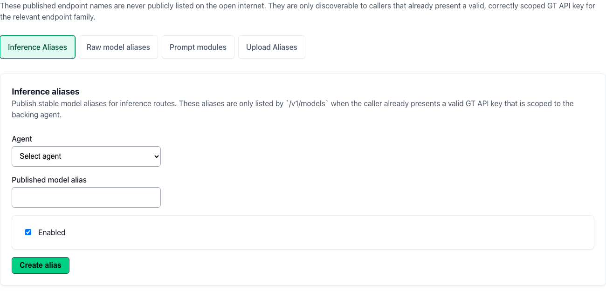

# GT API Published Endpoints

## Start Here

1. Confirm **GT API is enabled** for your account (`gtApiEnabled`).
2. Open **GT API** at `/gt-api` and select **Published Endpoints**.
2. Decide what external callers may put in OpenAI `model`: **agent aliases**, **raw-model catalog names**, or both.
3. Publish only the inference names that match your integration policy (tools, prompts, and modalities stay inside GT).
4. Create or update an [API key](gen3/gt-api/keys-and-access) whose allowlists include exactly those published names.
5. Validate with `GET /v1/models` using that key—the response must list only intended names.

## Why this matters

Published endpoints are the **public discovery surface** for GT API. Callers never need internal agent ids or provider model strings; they use published names GT maps to configured agents or operator-curated raw-model entries. If a name is not published—or not on the key allowlist—it must not appear in `/v1/models` or succeed on chat routes.

**In-app workspace:** [GT API](/gt-api) → **Published Endpoints**.

**Full documentation** (client runbooks, compatibility matrix, upload/file routes) is in Instructions under **GT API**—see [Client Runbooks](gen3/gt-api/client-runbooks) and [API Reference](gen3/gt-api/api-reference).

## Details

### Two kinds of published inference names

| Kind | What callers use in `model` | What stays internal |
| --- | --- | --- |
| **Agent alias** | Public alias string for a configured tenant agent (tools, base prompt, speech/vision/image settings). | Underlying provider routing and agent configuration. |
| **Published raw-model catalog name** | Operator-curated catalog entry for provider-backed inference alongside agents. | Provider credentials and routing policy. |

Both kinds can appear in `GET /v1/models` when the presenting key’s **agent allowlists** and **raw-model allowlists** permit them. The selectors on inference keys are **separate**—allow one without implying the other.

### Relationship to agents and models

- Build and tune agents in [Agents](gen3/agents) → **Agent Configuration** before publishing aliases.
- Control Panel operators register provider models on [Models](gen3-admin/models); tenant publishing decides which catalog names external callers may discover.

### Upload targets (separate from inference publishing)

Upload keys authorize dataset targets (`datasets:write`) or conversation-scoped uploads. Publishing inference names does **not** automatically grant upload access—scope upload keys and conversation linking explicitly.

### Operational practices

- Publish the **smallest** set of names required for each integration.
- Use distinct aliases when different apps need different tool, prompt, or modality policy.
- After changing published names, re-run client `GET /v1/models` validation before production traffic.

### Related pages

- [GT API Overview](gen3/gt-api/overview)
- [Keys and Access](gen3/gt-api/keys-and-access)
- [OpenAI Compatibility](gen3/gt-api/openai-compatibility)
- [Building Agents](gen3/agents/building)
