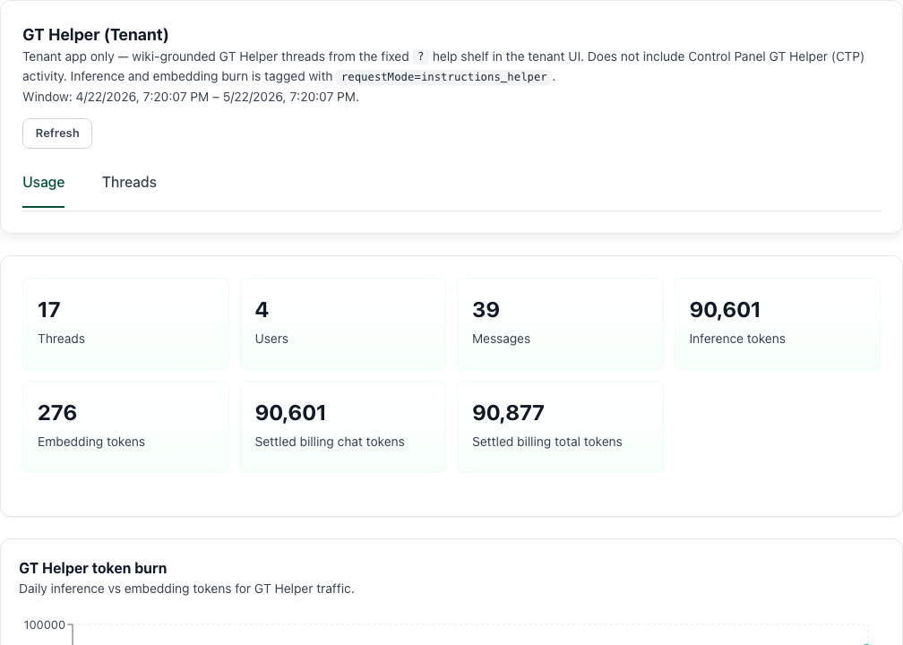

# Observability

## Start Here

1. Open **Management → Observability** from the tenant sidebar (all signed-in tenant roles can reach this route).
2. Read the scope banner at the top—it explains whether you see tenant-wide, managed-group, or personal activity.
3. Select the analytics tab available to your role (see the table below).
4. Apply filters before exporting or sharing summaries.

## Why this matters

Observability gives every tenant role evidence about usage and activity within their allowed scope. Tenant owners and managers use it for capacity and governance decisions; tenant users use it to review their own work without needing elevated administration access.

## Details

The tenant `Observability` route is the active Gen 3 analytics workspace at **Management → Observability**. All signed-in roles can open it from the sidebar, but **tabs, filters, and data scope depend on your tenant role** and whether GT API is enabled for your account.

## Tabs by role

| Tab | Tenant Owner | Tenant Manager | Tenant User |
| --- | --- | --- | --- |
| `Usage Overview` | Yes | Yes | Yes |
| `Conversations` | Yes | Yes | Yes |
| `Storage` | Yes | Yes | Yes |
| `Access Logs` | Yes | No | Yes |
| `GT API` | Yes (when GT API enabled) | Yes (when GT API enabled) | Yes (when GT API enabled) |
| `Billing` | Yes | No | No |
| `GT Helper (Tenant)` | Yes | Yes | Yes |

The **GT API** tab appears only when your account has **GT API enabled** (`gtApiEnabled`). If GT API is off for your tenant, owner and user roles still see the other tabs listed above; managers never see Access Logs or Billing regardless of GT API. **GT Helper (Tenant)** is visible for every signed-in tenant role and does not depend on GT API enablement.

## Scope is role-aware

Gen 3 computes observability scope from your role and, for some managers, managed-group assignments.

- **Tenant Owner:** tenant-wide visibility across all users and resources.
- **Tenant Manager with managed groups:** review activity through managed-group filters; may filter by user within that scope.
- **Tenant Manager without managed groups:** limited to your own activity and resources.
- **Tenant User:** limited to your own activity and resources.

If another user can see a wider scope or more tabs than you can, that is expected behavior rather than missing data.

## Main filters

The page can expose:

- time range
- user filter (owners; managers with managed-group scope)
- managed-group filter (managers with managed groups)
- agent filter
- search within conversation analytics

The available filters change with your effective scope. The **GT Helper (Tenant)** tab honors the same time range, managed-group, and user filters as the other analytics tabs.

## GT Helper (Tenant)

The **GT Helper (Tenant)** tab reports activity from the tenant app **?** help shelf only—the wiki-grounded [instructions helper](gen3/agents/helper-agent) opened from the fixed **?** bubble on the tenant shell. It does **not** include Control Panel **CTP Helper** traffic from the Control Panel instructions help shelf.

Helper inference and embedding burn is tagged with `requestMode=instructions_helper`. Use this tab when you need analytics on **Ask helper** threads, not when you are reviewing favorited chat agents or GT Chat conversations.

The tab has two sub-tabs: **Usage** and **Threads**.

### Usage

The **Usage** sub-tab summarizes helper activity for your current scope and time range.

- **Summary cards** — threads, users, messages, inference tokens, embedding tokens, and (when billing data is present) settled billing chat and total tokens.
- **Token time series** — daily inference vs embedding token burn for helper traffic.
- **Top topics** — wiki slugs and page paths cited across helper turns (topic label, slug, page path, and mention count).
- **Top users** — helper activity by signed-in tenant user (threads, messages, inference tokens). Shown only when your role can filter observability by user (tenant owners, and tenant managers with managed-group scope). Each row can set the top-bar **User** filter to that person.
- **Settled billing** — when the deployment exposes helper billing analytics, a breakdown of settled helper spend tagged with `requestMode=instructions_helper`: request counts, chat tokens, embedding tokens, and total tokens.

### Threads

The **Threads** sub-tab lists helper conversation threads for your current filters.

- **Search** — filter the thread list by text; press Enter or leave the field to apply.
- **Paginated table** — columns for thread title, owner (when your role sees an owner column), message count, last page, updated, and created. Use **Previous** / **Next** to page through results.
- **Expand a row** — loads the full helper transcript. Each message shows role, timestamp, and body text. Expanded messages can include metadata such as page path, model name, token counts (prompt, completion, embedding), and a **Source articles** list of wiki slugs cited for that turn.

### Scope and user filter

**GT Helper (Tenant)** uses the same observability scope as the other tabs:

- **Tenant Owner** — tenant-wide helper activity; **User** filter and **Top users** drill-down apply.
- **Tenant Manager with managed groups** — helper activity within the selected managed group; may filter by user within that scope.
- **Tenant Manager without managed groups** and **Tenant User** — only your own helper threads and usage.

Changing the top-bar **User** dropdown (when available) or clicking a name under **Top users** refreshes both Usage and Threads for that filter. The time range selector applies to helper analytics as well.

## Role-specific use

- Use the [Tenant Manager Guide](gen3/tenant-admin/tenant-managers) when you need help deciding whether an investigation is within manager authority.
- Use the [Tenant Owner Guide](gen3/tenant-admin/tenant-owners) when the incident requires unrestricted tenant-wide evidence or follow-up governance changes.

## Common tasks

### Review usage trends

Start with `Usage Overview` when you need a quick answer about current activity or whether a team, user, or managed group is consuming more resources than expected.

### Investigate a conversation pattern

Open the `Conversations` tab when you want analytical review rather than the full transcript workflow on [Conversations](gen3/conversations). This tab is designed for trend analysis and export, not for continuing a live thread.

### Review storage posture

Use the `Storage` tab to understand how much content is being retained and where retrieval-heavy footprint is accumulating.

### Review access events

Use `Access Logs` for sign-in and activity-event review when your role includes that tab (owners and tenant users). This is especially useful when diagnosing login issues or confirming whether access actually happened during a reported incident window.

### Review billing analytics

Use `Billing` when you are a tenant owner and the deployment exposes billing data. This view is analytic, not a configuration surface; Control Panel operators still own pricing and billing policy in the Control Panel `Financial Controls` page.

### Review GT API usage

Use the **GT API** tab when GT API is enabled for your account and you need integration traffic alongside chat and storage analytics.

### Review instructions helper usage

Open **GT Helper (Tenant)** when you need evidence about **?** shelf **Ask helper** traffic: token burn, cited wiki topics, per-user activity (when your role allows), settled helper billing, or full helper transcripts. This is separate from **Conversations** (favorited agent chat) and from Control Panel CTP Helper observability.

## Export behavior

Conversation analytics exports can be filtered before download. Apply the filters first, then export only the scope you actually need.

## Best practices

- Start broad, then narrow with filters once you see the overall pattern.
- Use observability for trend analysis and [Conversations](gen3/conversations) for thread-by-thread review.
- Treat managed-group scope as an intentional governance boundary, not a data-quality issue.
- Escalate to a tenant owner if you need tenant-wide visibility or billing tabs for an investigation.

## Related pages

- [GT Helper](gen3/agents/helper-agent)
- [Conversations](gen3/conversations)
- [Users](gen3/users)
- [Tenant Administration](gen3/tenant-admin)
- [GT API Overview](gen3/gt-api/overview)
